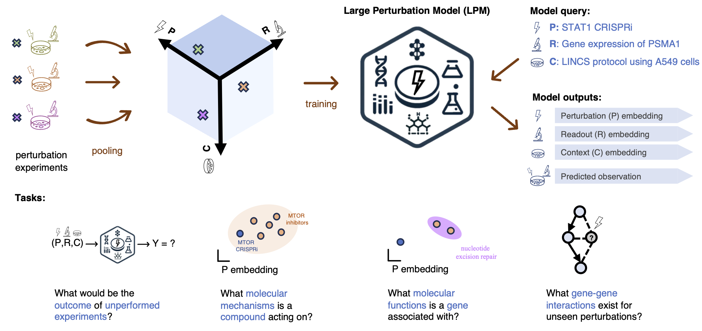

<h1 align="center">

</h1>
<p align="center"> <em>- Perturbation modeling at scale -</em> </p>
<br>

*Perturb-lib* is a library of tools for scalable modeling of biological perturbations from experimental data.
It provides an implementation of the *Large Perturbation Model (LPM)* from the paper "In silico biological discovery with Large Perturbation Models".
Furthermore, perturb-lib is a general framework that systematically collects data, embeddings, models, and evaluation tools useful for perturbation model.
It also includes *perturb-gym* which is a suite for easily configurable and scalable training of perturbation models.

## Contents

## Large Perturbation Model



Large Perturbation Model (LPM) is a deep-learning model that integrates information from
pooled perturbation experiments. In our paper, we trained LPM to predict the outcome of a
perturbation experiment based on the symbolic representation of the perturbation, readout,
and context (the P,R,C tuple). LPM features a PRC-conditioned architecture which enables
learning from heterogeneous perturbation experiments that do not necessarily
fully overlap in the perturbation, readout, or context dimensions. By explicitly conditioning
on the representation of an experimental context, LPM learns perturbation-response rules
disentangled from the specifics of the context in which the readouts were observed. LPM
predicts unseen perturbation outcomes, and its information-rich generalisable embeddings are
directly applicable to various other biological discovery tasks.

## Documentation including tutorials
Link to documentation: <LINK HERE>

In order to train an LPM on the LINCS L1000 data, as done in the paper, use the following command:
```bash
poetry run python -m perturb_gym.training train_from_config_file --config_file_id_or_path=lincs_paper_lpm
```

In order to train an LPM on the 2022 Replogle et al. data with validation and test perturbations from the K562 cell line, use the following command:
```bash
poetry run python -m perturb_gym.training train_from_config_file --config_file_id_or_path=replogle_k562_paper_lpm
```

In order to train an LPM on the 2022 Replogle et al. data with validation and test perturbations from the RPE1 cell line, use the following command:
```bash
poetry run python -m perturb_gym.training train_from_config_file --config_file_id_or_path=replogle_rpe1_paper_lpm
```

Each of the above will train 5 models with different random seeds.


## Authors


### Core maintainers
| Name | Institution |                 Contact                  |
| --- |-------------|:----------------------------------------:|
| **Ðorđe Miladinović** | GSK         |  djordjemethz@gmail.com  |
| **Andreas Georgiou** | GSK         | andreas.x.georgiou@gsk.com |

### Other contributors

| Name | Institution |         Contact          |
| --- |-------------|:------------------------:|
| **Lachlan Stuart** | GSK         | lachlan.n.stuart@gsk.com |
| **Tobias Höppe** | Helmholtz AI | tobihoeppe@gmail.com  |


## Citation

```
@article{miladinovic2025silico,
  title={In-silico biological discovery with large perturbation models},
  author={Miladinovic, Djordje and H{\"o}ppe, Tobias and Chevalley, Mathieu and Georgiou, Andreas and Stuart, Lachlan and Mehrjou, Arash and Bantscheff, Marcus and Sch{\"o}lkopf, Bernhard and Schwab, Patrick},
  journal={arXiv preprint arXiv:2503.23535},
  year={2025}
}
```
